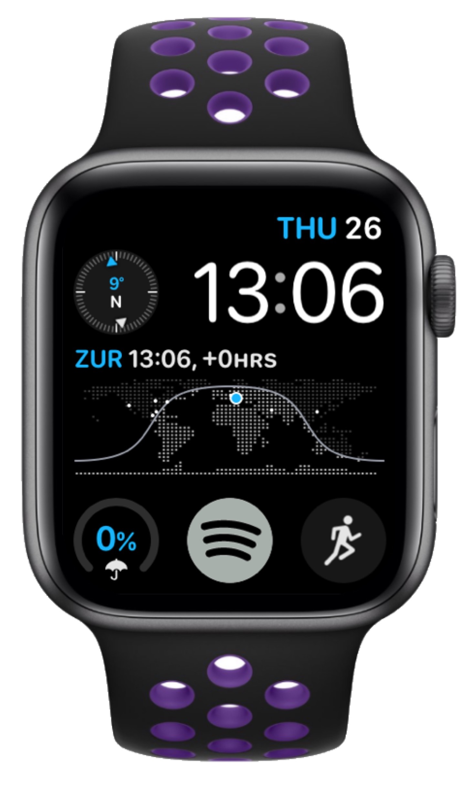

# watchOS

## Favorite watch face
{: style="height:350px"}

This is an adapted version of the Infograph Modular watch face. I've chosen the compass for the top left complication. It's probably the least useful of the bunch, although it's kinda nice to always have a sense of direction.   
In the middle is the world clock, which looks cool but also provides a bunch of useful information. You can see at a glance when sunrise and sunset occurs, which is useful when you're into photography. It also highlights any cities marked in the iOS world clock app. This is useful if you have foreign friends, or want to know when the stock market opens e.g. in New York.

For the bottom raw I have my two most used apps: Spotify and Workout. And finally on the left I have the rain indicator letting me know if I need an umbrella or not.

[Download watch face](resources/Infograph-Modular-Blue.watchface)

## Favorite apps
+ Spotify
+ Audible
+ Remote shutter
+ Workout